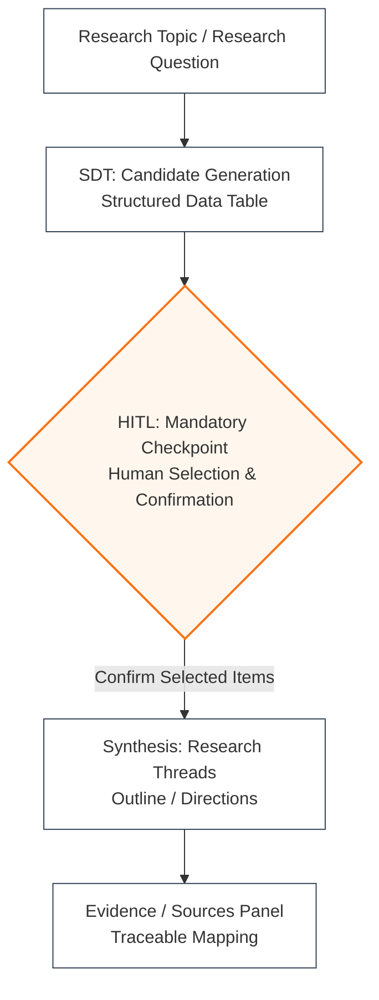

# 智研 Agent（Prototype）

> 面向人文社科研究者的 Research IDE + 工作流型 AI Agent  
> 通过结构化中间态（SDT）与强制人机协同断点（HITL），  
> 将研究中的“体力劳动”交给 AI，把关键决策权交还给人。

---

## 项目简介

**智研 Agent** 是一个面向人文社科研究场景的 AI Agent 原型。

它旨在将研究过程中高度重复、低创造性的环节（如检索、初筛、结构化整理）通过 Agent Workflow 完成，使研究者能够将精力集中于 AI 真正不可替代的思想判断、理论建构与方向性决策。

项目通过 **结构化中间态（SDT）** 与 **强制的人机协同断点（HITL）**，确保研究方向、论据选择与最终判断始终由用户掌控。
以 **Research IDE（集成式研究工作空间）** 为核心形态，而非聊天型工具，探索 AI 在严肃研究工作流中的合理位置。

---

## Why this Project?

当前主流的 AI 学术工具，并未真正解决研究者的实际工作流程问题：

1. **研究流程被工具割裂** ：

     文献检索、AI 辅助整理、写作与查重分散在不同工具中，研究者需要在多个软件之间反复切换，效率低且体验割裂。

2. **AI 与 Agent 能力在科研场景未深度融合** ：

    任务型 Agent 能串流程，却缺乏研究判断且过程黑盒；大模型具备思考深度能力，却无法被纳入可控工作流，二者难以协同。

3. **黑箱输出导致成本与风险失控** ：

    一次性报告式生成过程不可见、不可叫停，方向错误时不仅浪费成本，也模糊了研究责任边界。

智研 Agent 正是针对上述问题，尝试用 **工作流 + 人机协同机制**，以 **Research IDE（集成式研究工作空间）** 为核心形态，重构 AI 在研究中的参与方式。

---

## 设计核心亮点：以人机协同（HITL）作为研究护栏

智研 Agent 并未采用“一跑到底”的 Agent 设计，而是引入 **Human-in-the-Loop（HITL）** 强制断点，将人类判断制度化地嵌入研究流程中。

在这一流程中，AI 被明确限制为「研究助理」角色，而非研究主体或作者；关键决策权被“机制化”地留给用户。

1. **HITL：把伦理边界写进产品机制** 智研不是“让 AI 写论文”，而是通过强制断点让 AI 在关键节点必须停下，等待人类确认，避免工具替人作出研究判断，降低学术不端风险。

2. **SDT：用结构化中间态拆开黑盒** 候选条目、论据与来源先以结构化表格呈现，用户能看到“AI 到底拿了什么材料”，而不是被一段总结文本直接覆盖研究过程。

3. **可叫停、可纠偏：降低试错成本，提升命中率** 工作流把过程显性化：偏题可以在早期就停下或调整，而不是等到最终长文生成才发现不对，再推倒重来。

---


## 研究工作流示意图



---

## 当前已实现功能（Prototype）

- ✅ 本地前后端完整跑通（FastAPI + 前端原型）
- ✅ 研究流程闭环：**SDT → HITL → Synthesis**
- ✅ 候选文献以结构化表格（SDT）形式呈现
- ✅ 用户式勾选论据后，AI 才进入综合生成阶段（HITL 断点生效）
- ✅ Evidence / Sources 与生成内容保持对应关系（便于追溯与复盘）
- ✅ 支持真实大模型调用（模型可替换）

> 当前版本为 **单机原型（Local-first）**，重点验证流程合理性与协作机制，而非规模化能力。

---

## 技术选型说明

- **后端**：FastAPI  
- **前端**：HTML + 原生 JavaScript（原型阶段）  
- **模型层**：模型可替换（当前以通用大模型 API 为例）  
- **架构原则**：模型无关（Model-agnostic），流程优先于模型能力  

项目重点不在于“使用哪一个模型”，而在于 **如何编排模型参与研究流程**。

---

## 项目状态说明

⚠️ 本项目为 **研究型产品原型（Prototype）**：

- 未引入数据库持久化  
- 未实现多用户与权限系统  
- 未接入真实学术数据库（如 CNKI / Zotero 等）  
- 不以“可商用”或“完整 SaaS”作为当前目标  

**当前阶段目标：**

> 验证「结构化中间态（SDT）+ HITL 强制断点」  
> 是否能够显著提升研究型 AI 的可靠性、可控性与责任清晰度。

---

## Roadmap（下一步）

- [ ] 引入状态机机制（可暂停 / 可回溯的研究流程）
- [ ] 将 SDT 持久化，支持跨会话研究
- [ ] 前端升级为组件化框架（React / Vue）
- [ ] 探索文献导入能力（PDF / 文献管理工具）
- [ ] 写作编辑区（副驾驶式迭代，围绕“引用—论据—段落”联动）

---

## 如何运行（本地）

```bash
# 安装依赖
pip install -r requirements.txt

# 配置环境变量
cp .env.example .env

# 启动后端
python server.py
```

---

## 声明

本项目用于探索 AI Agent 在学术研究中的合理边界，不用于替代人工写作或规避学术规范。

